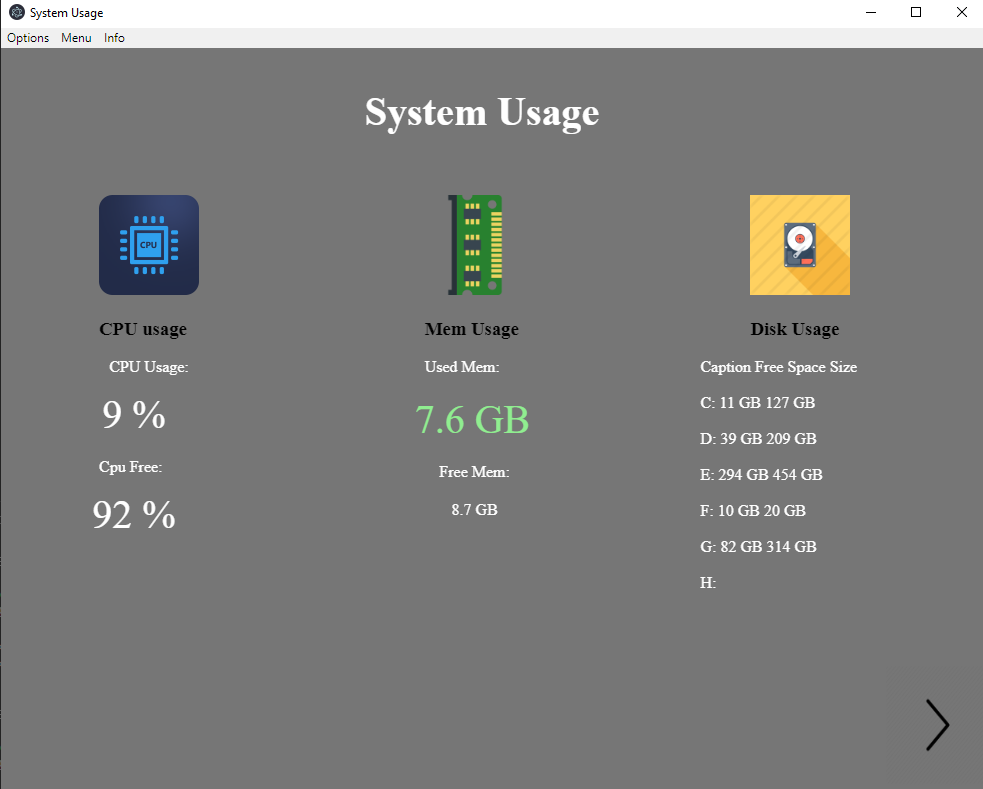

# Electron app
This is my first app made with Electron framework. It shows computer specs in clean and readable way.

Usage and free space in CPU and memory are upated in real time every second.
## Preview


## Instalation
To install dependencies
```js
npm install
```

To start developing and open window
```js
npm start
```